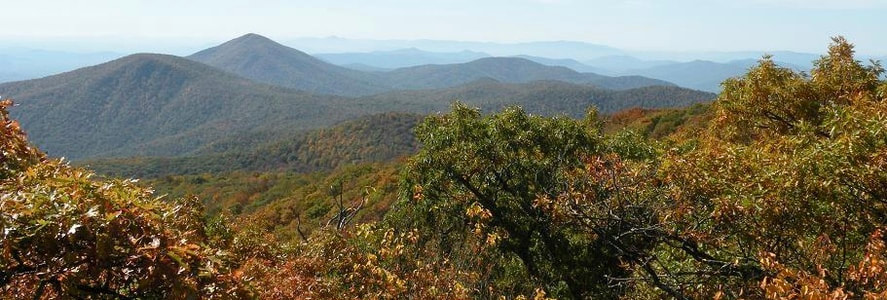

Established in 2009, the Appalachian Trail Golden Packet (ATGP) Event is an Amateur Radio event where operators set up a packet radio station on 15 mountain tops from Maine to Georgia on the third Saturday in July to attempt end-to-end APRS messages.

This was a goal established back around 1980 at the infancy of packet radio to do the first cross-country packet (golden, like the golden spike in Utah for the transcontinental railroad). But no one ever tried, since wormholes and then the global internet linked APRS stations made long-haul trivial to do. But in 2009 we decided to go try it the old way, and finally achieved success in 2014. In 2016 we did it at 9600 baud, and do it every year to try to improve on throughput.